# DELM Batch API Support

## Overview

Add batch API support to DELM using instructor's built-in `BatchProcessor`/`BatchRequest`. Two public methods on the DELM class: `export_batch()` to generate provider-formatted JSONL from preprocessed data, and `import_batch_results()` to parse a provider's results back into DELM's standard DataFrame. Convenience wrappers around `BatchProcessor` for submit/status/retrieve.

## Todos

- [ ] Create `src/delm/batch.py` with `BatchExporter` and `BatchImporter` classes
- [ ] Add `export_batch()` method to DELM class in `delm.py`
- [ ] Add `import_batch_results()` method to DELM class in `delm.py`
- [ ] Add `submit_batch()`, `check_batch_status()`, `download_batch_results()` convenience methods to DELM class
- [ ] Handle `validate_in_text` during batch import (load text chunks from experiment manager)

## Architecture

DELM's batch support is a thin layer on top of `instructor.batch.BatchProcessor` and `instructor.batch.BatchRequest`. No custom JSONL formatting, no custom response parsing, no mock transports.

```mermaid
flowchart TB
    subgraph delmLayer [DELM Layer]
        exportBatch["DELM.export_batch()"]
        importResults["DELM.import_batch_results()"]
        submitBatch["DELM.submit_batch()"]
        batchStatus["DELM.check_batch_status()"]
        downloadResults["DELM.download_batch_results()"]
    end

    subgraph instructorLayer [Instructor Layer]
        BatchRequest
        BatchProcessor
        ParseResults["parse_results()"]
    end

    subgraph delmExisting [Existing DELM Code]
        prepData["prep_data()"]
        createPrompt["schema.create_prompt()"]
        createSchema["schema.create_pydantic_schema()"]
        validateParse["schema.validate_and_parse_response_to_dict()"]
        parseResultsDf["parse_results_dataframe pattern"]
    end

    exportBatch --> prepData
    exportBatch --> createPrompt
    exportBatch --> createSchema
    exportBatch --> BatchRequest

    importResults --> ParseResults
    importResults --> validateParse
    importResults --> parseResultsDf

    submitBatch --> BatchProcessor
    batchStatus --> BatchProcessor
    downloadResults --> BatchProcessor
```



## Key Design Decisions

### Why instructor's BatchProcessor instead of mock HTTP transport?

We considered using a mock HTTP transport to intercept instructor's live request pipeline, which would guarantee byte-for-byte identical requests to live extraction. However, instructor already has comprehensive batch support that:

1. Already works with DELM's dynamic Pydantic schemas (verified)
2. Already handles OpenAI, Anthropic, AND Google GenAI
3. Already parses results back to typed Pydantic models
4. Already has submit/status/retrieve lifecycle
5. Already has CLI integration (`instructor batch` commands)
6. Near-zero maintenance burden
7. Drastically less code to write and test (~150 lines vs ~500+)

**Mode difference**: instructor's `BatchRequest` always uses `json_schema` (structured outputs) for OpenAI and `tool_use` for Anthropic, regardless of DELM's configured mode. This is intentional -- these are the most reliable modes for each provider's batch API. The structured output quality is the same.

### Supported Providers

**Export/Import** (`export_batch` / `import_batch_results`):
- **OpenAI** (native batch API, 50% cost savings)
- **OpenAI-compatible** (Together, Groq, Fireworks -- use OpenAI SDK format)
- **Anthropic** (Message Batches API, 50% cost savings)

**Full lifecycle only** (`submit_batch` / `check_batch_status` / `download_batch_results`):
- **Google GenAI** (Vertex AI Batch Prediction, 50% cost savings) -- Google uses a fundamentally different batch mechanism (GCS + Vertex AI). `BatchRequest` has no `to_google_format()` method, so export/import is not supported. Google batch is only available through the convenience lifecycle helpers, which delegate entirely to instructor's `BatchProcessor`.

### `max_tokens` vs `max_completion_tokens`

Instructor's `BatchRequest` uses the `max_tokens` field, which serializes to `"max_tokens"` in the OpenAI JSONL body. DELM normally uses `max_completion_tokens` (a newer OpenAI parameter that limits output tokens only, vs `max_tokens` which is older and limits total tokens). For batch export, we pass `model_config.max_completion_tokens` as the `max_tokens` value. This is a known limitation of instructor's `BatchRequest` -- the output parameter name is `max_tokens` regardless. For modern OpenAI models this may be silently accepted or cause a deprecation warning. If this becomes an issue, we can post-process the JSONL dict to rename the field before writing.

## New File: `src/delm/batch.py`

Single new file containing all batch-related logic. No new package/directory needed since the implementation is compact.

### `BatchExporter` class

Handles JSONL generation and metadata:

```python
from instructor.batch import BatchRequest
from tqdm.auto import tqdm
import json

class BatchExporter:
    def export(
        self,
        text_chunks: list[str],
        chunk_ids: list[int],
        pydantic_schema: type[BaseModel],
        extraction_schema: ExtractionSchema,
        model_config: LLMExtractionConfig,
        schema_dict: dict,
        output_path: str,
    ) -> str:
        """Generate batch JSONL file and metadata sidecar."""
        metadata_path = output_path.replace(".jsonl", "_metadata.json")
        chunk_id_mapping = {}
        
        with open(output_path, "w") as f:
            for chunk, chunk_id in tqdm(
                zip(text_chunks, chunk_ids),
                total=len(text_chunks),
                desc="Exporting batch requests",
            ):
                prompt = extraction_schema.create_prompt(chunk, model_config.prompt_template)
                custom_id = f"delm-chunk-{chunk_id}"
                chunk_id_mapping[custom_id] = chunk_id
                
                batch_req = BatchRequest(
                    custom_id=custom_id,
                    messages=[
                        {"role": "system", "content": model_config.system_prompt},
                        {"role": "user", "content": prompt},
                    ],
                    response_model=pydantic_schema,
                    model=model_config.model,
                    max_tokens=model_config.max_completion_tokens,
                    temperature=model_config.temperature,
                )
                
                if model_config.provider == "anthropic":
                    line = json.dumps(batch_req.to_anthropic_format())
                else:
                    line = json.dumps(batch_req.to_openai_format())
                f.write(line + "\n")
        
        # Write metadata sidecar
        metadata = {
            "provider": model_config.provider,
            "model": model_config.model,
            "chunk_id_mapping": chunk_id_mapping,
            "schema": schema_dict,
            "total_requests": len(text_chunks),
        }
        with open(metadata_path, "w") as f:
            json.dump(metadata, f, indent=2)
        
        return metadata_path
```

Key details:

- Uses `BatchRequest` directly (not `create_batch_from_messages`) so we control custom_ids
- custom_id format: `delm-chunk-{chunk_id}` for clear mapping
- Provider detection: `to_anthropic_format()` for Anthropic, `to_openai_format()` for everything else (OpenAI-compatible providers)
- Metadata sidecar stores chunk_id mapping, schema, provider info
- `schema_dict` is passed in from the DELM layer via `self.config.schema.to_dict()` (the `Schema` wrapper, not `ExtractionSchema`)
- tqdm progress bar wraps the export loop

### `BatchImporter` class

Handles parsing results back into DELM's DataFrame format.

**Critical detail on `validate_in_text`**: The schema cleaning method `validate_and_parse_response_to_dict()` internally calls `_clean()`, which filters extracted values against `text_chunk.lower()`. Passing an empty string would silently drop ALL values for any variable with `validate_in_text=True`. If such a variable is also `required=True`, the entire response gets rejected (returns empty dict). This would be a silent data loss bug.

**Solution**: Load text chunks from the experiment manager (preprocessed data saved during `export_batch`). The DELM class always calls `prep_data()` before export, which saves preprocessed data to the experiment manager. During import, we load this data to get the chunk_id -> text_chunk mapping. This requires the same DELM instance (or same experiment path) for export and import.

```python
from instructor.batch import BatchProcessor
from tqdm.auto import tqdm

class BatchImporter:
    def import_results(
        self,
        results_path: str,
        metadata_path: str,
        extraction_schema: ExtractionSchema,
        pydantic_schema: type[BaseModel],
        text_chunks_by_id: dict[int, str],
    ) -> pd.DataFrame:
        """Parse batch results JSONL into DELM DataFrame.
        
        Args:
            results_path: Path to the provider's results JSONL file.
            metadata_path: Path to the metadata sidecar JSON file.
            extraction_schema: The extraction schema for validation/cleaning.
            pydantic_schema: The Pydantic model class for result parsing.
            text_chunks_by_id: Mapping of chunk_id -> original text chunk,
                used for validate_in_text validation.
        """
        metadata = json.load(open(metadata_path))
        chunk_id_mapping = metadata["chunk_id_mapping"]
        provider = metadata["provider"]
        
        # Use instructor's result parser directly.
        # We instantiate BatchProcessor only for its parse_results() method.
        # NOTE: BatchProcessor.__init__ calls get_provider() which may try
        # to import provider SDKs. If this fails without an API key, we can
        # fall back to using BatchJob.parse_from_string() instead, which
        # has no provider dependency.
        processor = BatchProcessor(
            f"{provider}/{metadata['model']}", pydantic_schema
        )
        with open(results_path) as f:
            results_content = f.read()
        batch_results = processor.parse_results(results_content)
        
        # Convert to DELM DataFrame format
        rows = []
        for result in tqdm(batch_results, desc="Parsing batch results"):
            custom_id = result.custom_id
            chunk_id = chunk_id_mapping.get(custom_id)
            
            if chunk_id is None:
                rows.append({
                    SYSTEM_CHUNK_ID_COLUMN: None,
                    SYSTEM_BATCH_ID_COLUMN: 0,
                    SYSTEM_CHUNK_COLUMN: None,
                    SYSTEM_EXTRACTED_DATA_JSON_COLUMN: None,
                    SYSTEM_ERRORS_COLUMN: json.dumps({
                        "error_type": "mapping_error",
                        "error_message": f"Unknown custom_id: {custom_id}",
                    }),
                })
                continue
            
            text_chunk = text_chunks_by_id.get(chunk_id, "")
            
            if result.success:
                cleaned = extraction_schema.validate_and_parse_response_to_dict(
                    result.result, text_chunk
                )
                rows.append({
                    SYSTEM_CHUNK_ID_COLUMN: chunk_id,
                    SYSTEM_BATCH_ID_COLUMN: 0,
                    SYSTEM_CHUNK_COLUMN: text_chunk,
                    SYSTEM_EXTRACTED_DATA_JSON_COLUMN: json.dumps(cleaned),
                    SYSTEM_ERRORS_COLUMN: None,
                })
            else:
                rows.append({
                    SYSTEM_CHUNK_ID_COLUMN: chunk_id,
                    SYSTEM_BATCH_ID_COLUMN: 0,
                    SYSTEM_CHUNK_COLUMN: text_chunk,
                    SYSTEM_EXTRACTED_DATA_JSON_COLUMN: None,
                    SYSTEM_ERRORS_COLUMN: json.dumps({
                        "error_type": result.error_type,
                        "error_message": result.error_message,
                    }),
                })
        
        return pd.DataFrame(rows)
```

Key details:

- Uses `BatchProcessor.parse_results()` for provider-aware result extraction (handles OpenAI json_schema and Anthropic tool_use)
- Maps `custom_id` back to `chunk_id` via metadata
- **Passes actual text chunk** (not empty string) to `validate_and_parse_response_to_dict()` so `validate_in_text` works correctly
- Includes all 5 DataFrame columns matching `parse_results_dataframe()`: `SYSTEM_CHUNK_ID_COLUMN`, `SYSTEM_BATCH_ID_COLUMN`, `SYSTEM_CHUNK_COLUMN`, `SYSTEM_EXTRACTED_DATA_JSON_COLUMN`, `SYSTEM_ERRORS_COLUMN`
- `SYSTEM_BATCH_ID_COLUMN` is set to 0 (single batch from provider perspective)
- Handles unknown `custom_id` gracefully with an error row
- tqdm progress bar wraps the parsing loop
- Fallback note: if `BatchProcessor` init fails due to missing API key, can use `BatchJob.parse_from_string()` instead (no provider dependency, but loses typed results -- would need manual extraction)

## Changes to `src/delm/delm.py`

Add these public methods to the `DELM` class:

### `export_batch(self, data, output_path, sample_size=-1)`

```python
def export_batch(self, data, output_path: str, sample_size: int = -1) -> tuple[str, str]:
    """Export batch JSONL file for provider batch API.
    
    Preprocesses data (same as extract()), then generates a JSONL file
    formatted for the configured provider's batch API, plus a metadata
    sidecar JSON file needed for import_batch_results().
    
    Args:
        data: Input data (file path, Path, or DataFrame).
        output_path: Path for the output JSONL file. Must end in .jsonl.
        sample_size: Number of records to sample (-1 for all).
    
    Returns:
        Tuple of (jsonl_path, metadata_path).
    
    Raises:
        ValueError: If provider does not support batch export (e.g. Google).
    """
    provider = self.config.llm_extraction_cfg.provider
    if provider not in ("openai", "anthropic"):
        # OpenAI-compatible providers (together, groq, fireworks) use openai format
        # but we should warn if it's an unknown provider
        if not self.config.llm_extraction_cfg.base_url:
            raise ValueError(
                f"Batch export is only supported for 'openai', 'anthropic', and "
                f"OpenAI-compatible providers (with base_url). Got: '{provider}'. "
                f"For Google GenAI, use the submit_batch() convenience helper instead."
            )
    
    self.prep_data(data, sample_size)
    data_df = self.experiment_manager.load_preprocessed_data()
    
    chunk_ids = data_df[SYSTEM_CHUNK_ID_COLUMN].tolist()
    text_chunks = data_df[SYSTEM_CHUNK_COLUMN].tolist()
    pydantic_schema = self.config.schema.schema.create_pydantic_schema()
    
    exporter = BatchExporter()
    metadata_path = exporter.export(
        text_chunks=text_chunks,
        chunk_ids=chunk_ids,
        pydantic_schema=pydantic_schema,
        extraction_schema=self.config.schema.schema,
        model_config=self.config.llm_extraction_cfg,
        schema_dict=self.config.schema.to_dict(),
        output_path=output_path,
    )
    return output_path, metadata_path
```

### `import_batch_results(self, results_path, metadata_path)`

`metadata_path` is a **required** parameter (not optional). Auto-discovery of the metadata path from the results path is unreliable because the export and results files will have completely different names (the provider returns results with its own naming).

```python
def import_batch_results(self, results_path: str, metadata_path: str) -> pd.DataFrame:
    """Import batch API results into DELM DataFrame.
    
    Parses the provider's results JSONL, validates each result against
    the extraction schema, and returns a DataFrame in the same format
    as extract().
    
    Requires that export_batch() was called on this DELM instance (or
    an instance with the same experiment_path) so that preprocessed data
    is available for validate_in_text validation.
    
    Args:
        results_path: Path to the provider's results JSONL file.
        metadata_path: Path to the metadata sidecar JSON file created
            by export_batch().
    
    Returns:
        DataFrame with columns matching extract() output.
    """
    pydantic_schema = self.config.schema.schema.create_pydantic_schema()
    
    # Load preprocessed data to get text chunks for validate_in_text
    preprocessed_data = self.experiment_manager.load_preprocessed_data()
    text_chunks_by_id = dict(zip(
        preprocessed_data[SYSTEM_CHUNK_ID_COLUMN].tolist(),
        preprocessed_data[SYSTEM_CHUNK_COLUMN].tolist(),
    ))
    
    importer = BatchImporter()
    results_df = importer.import_results(
        results_path=results_path,
        metadata_path=metadata_path,
        extraction_schema=self.config.schema.schema,
        pydantic_schema=pydantic_schema,
        text_chunks_by_id=text_chunks_by_id,
    )
    
    # Merge with preprocessed metadata (same pattern as process_via_llm)
    meta_data = preprocessed_data.drop(columns=[SYSTEM_CHUNK_COLUMN])
    results_df = pd.merge(results_df, meta_data, on=SYSTEM_CHUNK_ID_COLUMN, how="left")
    
    # Save to experiment manager
    self.experiment_manager.save_extracted_data(results_df)
    
    return results_df
```

### Convenience helpers (wrap BatchProcessor)

These make real API calls and require valid API keys.

```python
def submit_batch(self, jsonl_path: str, **kwargs) -> str:
    """Submit batch JSONL to provider. Returns batch ID.
    
    Makes a real API call -- requires valid API key for the provider.
    """
    pydantic_schema = self.config.schema.schema.create_pydantic_schema()
    provider_string = self.config.llm_extraction_cfg.get_provider_string()
    processor = BatchProcessor(provider_string, pydantic_schema)
    return processor.submit_batch(jsonl_path, **kwargs)

def check_batch_status(self, batch_id: str) -> dict:
    """Check batch job status.
    
    Makes a real API call -- requires valid API key for the provider.
    """
    pydantic_schema = self.config.schema.schema.create_pydantic_schema()
    provider_string = self.config.llm_extraction_cfg.get_provider_string()
    processor = BatchProcessor(provider_string, pydantic_schema)
    return processor.get_batch_status(batch_id)

def download_batch_results(self, batch_id: str, output_path: str) -> str:
    """Download batch results to file.
    
    Makes a real API call -- requires valid API key for the provider.
    """
    pydantic_schema = self.config.schema.schema.create_pydantic_schema()
    provider_string = self.config.llm_extraction_cfg.get_provider_string()
    processor = BatchProcessor(provider_string, pydantic_schema)
    processor.get_results(batch_id, file_path=output_path)
    return output_path
```

## User Workflow

```python
from delm import DELM

delm = DELM(
    schema="schema.yaml",
    provider="openai",
    model="gpt-4o-mini",
)

# Phase 1: Export
jsonl_path, metadata_path = delm.export_batch("data.csv", "batch_requests.jsonl")

# Phase 2: Submit + wait (convenience helpers, or manual via OpenAI SDK)
batch_id = delm.submit_batch(jsonl_path)

status = delm.check_batch_status(batch_id)
# ... poll until completed ...

delm.download_batch_results(batch_id, "batch_results.jsonl")

# Phase 3: Import
results_df = delm.import_batch_results("batch_results.jsonl", metadata_path)
```

## Files Changed

- **`src/delm/batch.py`** -- New file with `BatchExporter` and `BatchImporter` classes (~200 lines)
- **`src/delm/delm.py`** -- Add `export_batch()`, `import_batch_results()`, `submit_batch()`, `check_batch_status()`, `download_batch_results()` methods

## Review Fixes Applied

Issues found during review and their resolutions:

1. **FIXED (Critical): `validate_in_text` silent data loss** -- Passing `""` for `text_chunk` would silently drop all values for `validate_in_text=True` variables. Now loads actual text chunks from experiment manager via `text_chunks_by_id` dict.

2. **FIXED (Bug): `schema.to_dict()` undefined variable** -- `BatchExporter.export()` now takes a `schema_dict: dict` parameter. The DELM layer passes `self.config.schema.to_dict()` (the `Schema` wrapper's serialization).

3. **FIXED (Bug): `rstrip("_results")` strips individual chars** -- Removed auto-discovery entirely. `metadata_path` is now a required parameter on `import_batch_results()`.

4. **FIXED (Bug): Missing DataFrame columns** -- `BatchImporter` output now includes all 5 columns: `SYSTEM_CHUNK_ID_COLUMN`, `SYSTEM_BATCH_ID_COLUMN`, `SYSTEM_CHUNK_COLUMN`, `SYSTEM_EXTRACTED_DATA_JSON_COLUMN`, `SYSTEM_ERRORS_COLUMN`.

5. **DOCUMENTED: `max_tokens` vs `max_completion_tokens`** -- Added "max_tokens vs max_completion_tokens" section explaining the known semantic mismatch and when to address it.

6. **FIXED: Google support overstated** -- Provider support section now clearly separates "Export/Import" providers (OpenAI, Anthropic) from "Full lifecycle only" (Google). `export_batch()` validates the provider and raises `ValueError` for unsupported providers.

7. **DOCUMENTED: `BatchProcessor` init may need API key** -- Added inline note in `BatchImporter` about fallback to `BatchJob.parse_from_string()` if `BatchProcessor` init fails.

8. **FIXED: Unimplemented metadata merge** -- `import_batch_results()` now fully implements the merge with preprocessed metadata, matching the pattern from `process_via_llm()`.

9. **FIXED: Missing tqdm** -- Both export loop and import loop now use tqdm progress bars.

## Research References

- [Instructor Batch Processing Docs](https://python.useinstructor.com/concepts/batch)
- [Instructor BatchProcessor Source](https://github.com/567-labs/instructor/blob/main/instructor/batch/processor.py)
- [Instructor BatchRequest Source](https://github.com/567-labs/instructor/blob/main/instructor/batch/request.py)
- [OpenAI Batch API Docs](https://developers.openai.com/api/docs/guides/batch)
- [Anthropic Batch Processing Docs](https://docs.anthropic.com/en/docs/build-with-claude/batch-processing)
- [Instructor Hooks Docs](https://python.useinstructor.com/concepts/hooks)
