# DELM Batch API Support

## Overview

Add batch API support to DELM using instructor's built-in `BatchProcessor`/`BatchRequest`. Two public methods on the DELM class: `export_batch()` to generate provider-formatted JSONL from preprocessed data, and `import_batch_results()` to parse a provider's results back into DELM's standard DataFrame. Convenience wrappers around `BatchProcessor` for submit/status/retrieve.

## Todos

- [ ] Create `src/delm/batch.py` with `BatchExporter` and `BatchImporter` classes
- [ ] Add `export_batch()` method to DELM class in `delm.py`
- [ ] Add `import_batch_results()` method to DELM class in `delm.py`
- [ ] Add `submit_batch()`, `check_batch_status()`, `download_batch_results()` convenience methods to DELM class
- [ ] Handle `validate_in_text` during batch import (load text chunks from experiment manager or skip)

## Architecture

DELM's batch support is a thin layer on top of `instructor.batch.BatchProcessor` and `instructor.batch.BatchRequest`. No custom JSONL formatting, no custom response parsing, no mock transports.

```mermaid
flowchart TB
    subgraph delmLayer [DELM Layer]
        exportBatch["DELM.export_batch()"]
        importResults["DELM.import_batch_results()"]
        submitBatch["DELM.submit_batch()"]
        batchStatus["DELM.check_batch_status()"]
        downloadResults["DELM.download_batch_results()"]
    end

    subgraph instructorLayer [Instructor Layer]
        BatchRequest
        BatchProcessor
        ParseResults["parse_results()"]
    end

    subgraph delmExisting [Existing DELM Code]
        prepData["prep_data()"]
        createPrompt["schema.create_prompt()"]
        createSchema["schema.create_pydantic_schema()"]
        validateParse["schema.validate_and_parse_response_to_dict()"]
        parseResultsDf["parse_results_dataframe pattern"]
    end

    exportBatch --> prepData
    exportBatch --> createPrompt
    exportBatch --> createSchema
    exportBatch --> BatchRequest

    importResults --> ParseResults
    importResults --> validateParse
    importResults --> parseResultsDf

    submitBatch --> BatchProcessor
    batchStatus --> BatchProcessor
    downloadResults --> BatchProcessor
```



## Key Design Decisions

### Why instructor's BatchProcessor instead of mock HTTP transport?

We considered using a mock HTTP transport to intercept instructor's live request pipeline, which would guarantee byte-for-byte identical requests to live extraction. However, instructor already has comprehensive batch support that:

1. Already works with DELM's dynamic Pydantic schemas (verified)
2. Already handles OpenAI, Anthropic, AND Google GenAI
3. Already parses results back to typed Pydantic models
4. Already has submit/status/retrieve lifecycle
5. Already has CLI integration (`instructor batch` commands)
6. Near-zero maintenance burden
7. Drastically less code to write and test (~150 lines vs ~500+)

**Mode difference**: instructor's `BatchRequest` always uses `json_schema` (structured outputs) for OpenAI and `tool_use` for Anthropic, regardless of DELM's configured mode. This is intentional -- these are the most reliable modes for each provider's batch API. The structured output quality is the same.

### Supported Providers (v1)

- **OpenAI** (native batch API, 50% cost savings)
- **OpenAI-compatible** (Together, Groq, Fireworks -- use OpenAI SDK format)
- **Anthropic** (Message Batches API, 50% cost savings)
- **Google GenAI** (Vertex AI Batch Prediction, 50% cost savings)

## New File: `src/delm/batch.py`

Single new file containing all batch-related logic. No new package/directory needed since the implementation is compact.

### `BatchExporter` class

Handles JSONL generation and metadata:

```python
from instructor.batch import BatchRequest
import json

class BatchExporter:
    def export(
        self,
        text_chunks: list[str],
        chunk_ids: list[int],
        pydantic_schema: type[BaseModel],
        extraction_schema: ExtractionSchema,
        model_config: LLMExtractionConfig,
        output_path: str,
    ) -> str:
        """Generate batch JSONL file and metadata sidecar."""
        metadata_path = output_path.replace(".jsonl", "_metadata.json")
        chunk_id_mapping = {}
        
        with open(output_path, "w") as f:
            for i, (chunk, chunk_id) in enumerate(zip(text_chunks, chunk_ids)):
                prompt = extraction_schema.create_prompt(chunk, model_config.prompt_template)
                custom_id = f"delm-chunk-{chunk_id}"
                chunk_id_mapping[custom_id] = chunk_id
                
                batch_req = BatchRequest(
                    custom_id=custom_id,
                    messages=[
                        {"role": "system", "content": model_config.system_prompt},
                        {"role": "user", "content": prompt},
                    ],
                    response_model=pydantic_schema,
                    model=model_config.model,
                    max_tokens=model_config.max_completion_tokens,
                    temperature=model_config.temperature,
                )
                
                if model_config.provider == "anthropic":
                    line = json.dumps(batch_req.to_anthropic_format())
                else:
                    line = json.dumps(batch_req.to_openai_format())
                f.write(line + "\n")
        
        # Write metadata sidecar
        metadata = {
            "provider": model_config.provider,
            "model": model_config.model,
            "chunk_id_mapping": chunk_id_mapping,
            "schema": schema.to_dict(),  # from Schema wrapper
            "total_requests": len(text_chunks),
        }
        with open(metadata_path, "w") as f:
            json.dump(metadata, f, indent=2)
        
        return metadata_path
```

Key details:

- Uses `BatchRequest` directly (not `create_batch_from_messages`) so we control custom_ids
- custom_id format: `delm-chunk-{chunk_id}` for clear mapping
- Provider detection: `to_anthropic_format()` for Anthropic, `to_openai_format()` for everything else (OpenAI-compatible providers)
- Metadata sidecar stores chunk_id mapping, schema, provider info

### `BatchImporter` class

Handles parsing results back into DELM's DataFrame format:

```python
from instructor.batch import BatchProcessor

class BatchImporter:
    def import_results(
        self,
        results_path: str,
        metadata_path: str,
        extraction_schema: ExtractionSchema,
        pydantic_schema: type[BaseModel],
    ) -> pd.DataFrame:
        """Parse batch results JSONL into DELM DataFrame."""
        metadata = json.load(open(metadata_path))
        chunk_id_mapping = metadata["chunk_id_mapping"]
        provider = metadata["provider"]
        
        # Use instructor's result parser
        processor = BatchProcessor(
            f"{provider}/{metadata['model']}", pydantic_schema
        )
        with open(results_path) as f:
            results_content = f.read()
        batch_results = processor.parse_results(results_content)
        
        # Convert to DELM DataFrame format
        rows = []
        for result in batch_results:
            custom_id = result.custom_id
            chunk_id = chunk_id_mapping.get(custom_id)
            
            if result.success:
                # Run through DELM's validation/cleaning
                cleaned = extraction_schema.validate_and_parse_response_to_dict(
                    result.result, ""  # no text_chunk available for validate_in_text
                )
                rows.append({
                    SYSTEM_CHUNK_ID_COLUMN: chunk_id,
                    SYSTEM_EXTRACTED_DATA_JSON_COLUMN: json.dumps(cleaned),
                    SYSTEM_ERRORS_COLUMN: None,
                })
            else:
                rows.append({
                    SYSTEM_CHUNK_ID_COLUMN: chunk_id,
                    SYSTEM_EXTRACTED_DATA_JSON_COLUMN: None,
                    SYSTEM_ERRORS_COLUMN: json.dumps({
                        "error_type": result.error_type,
                        "error_message": result.error_message,
                    }),
                })
        
        return pd.DataFrame(rows)
```

Key details:

- Uses `BatchProcessor.parse_results()` for provider-aware result extraction (handles OpenAI json_schema and Anthropic tool_use)
- Maps `custom_id` back to `chunk_id` via metadata
- Runs each parsed Pydantic model through DELM's existing `validate_and_parse_response_to_dict()` for cleaning/validation
- Builds DataFrame with same columns as `extraction_manager.py` `parse_results_dataframe()`
- Note: `validate_in_text` won't work because we don't have the text chunks at import time -- we should store them in metadata or load from experiment manager

### `validate_in_text` consideration

DELM's schema cleaning can validate that extracted values appear in the source text (`validate_in_text` flag on ExtractionVariable). For batch import, we need access to the original text chunks. Two options:

- Store text chunks in the metadata sidecar (increases file size but is self-contained)
- Load from experiment manager (requires that `prep_data` was called with disk storage)

Recommended: Load from experiment manager if available, fall back to skipping `validate_in_text` validation. The text chunks can be very large so storing them in metadata is impractical.

## Changes to `src/delm/delm.py`

Add these public methods to the `DELM` class:

### `export_batch(self, data, output_path, sample_size=-1)`

```python
def export_batch(self, data, output_path: str, sample_size: int = -1) -> tuple[str, str]:
    """Export batch JSONL file for provider batch API.
    
    Returns (jsonl_path, metadata_path).
    """
    self.prep_data(data, sample_size)
    data_df = self.experiment_manager.load_preprocessed_data()
    
    chunk_ids = data_df[SYSTEM_CHUNK_ID_COLUMN].tolist()
    text_chunks = data_df[SYSTEM_CHUNK_COLUMN].tolist()
    pydantic_schema = self.config.schema.schema.create_pydantic_schema()
    
    exporter = BatchExporter()
    metadata_path = exporter.export(
        text_chunks=text_chunks,
        chunk_ids=chunk_ids,
        pydantic_schema=pydantic_schema,
        extraction_schema=self.config.schema.schema,
        model_config=self.config.llm_extraction_cfg,
        output_path=output_path,
    )
    return output_path, metadata_path
```

### `import_batch_results(self, results_path, metadata_path=None)`

```python
def import_batch_results(self, results_path: str, metadata_path: str = None) -> pd.DataFrame:
    """Import batch API results into DELM DataFrame."""
    if metadata_path is None:
        metadata_path = results_path.replace(".jsonl", "").rstrip("_results") + "_metadata.json"
        # Also try the standard naming convention
    
    pydantic_schema = self.config.schema.schema.create_pydantic_schema()
    
    importer = BatchImporter()
    results_df = importer.import_results(
        results_path=results_path,
        metadata_path=metadata_path,
        extraction_schema=self.config.schema.schema,
        pydantic_schema=pydantic_schema,
    )
    
    # Merge with metadata from preprocessed data if available
    # (same pattern as process_via_llm)
    ...
    
    return results_df
```

### Convenience helpers (wrap BatchProcessor)

```python
def submit_batch(self, jsonl_path: str, **kwargs) -> str:
    """Submit batch JSONL to provider. Returns batch ID."""
    pydantic_schema = self.config.schema.schema.create_pydantic_schema()
    provider_string = self.config.llm_extraction_cfg.get_provider_string()
    processor = BatchProcessor(provider_string, pydantic_schema)
    return processor.submit_batch(jsonl_path, **kwargs)

def check_batch_status(self, batch_id: str) -> dict:
    """Check batch job status."""
    pydantic_schema = self.config.schema.schema.create_pydantic_schema()
    provider_string = self.config.llm_extraction_cfg.get_provider_string()
    processor = BatchProcessor(provider_string, pydantic_schema)
    return processor.get_batch_status(batch_id)

def download_batch_results(self, batch_id: str, output_path: str) -> str:
    """Download batch results to file."""
    pydantic_schema = self.config.schema.schema.create_pydantic_schema()
    provider_string = self.config.llm_extraction_cfg.get_provider_string()
    processor = BatchProcessor(provider_string, pydantic_schema)
    processor.get_results(batch_id, file_path=output_path)
    return output_path
```

## User Workflow

```python
from delm import DELM

delm = DELM(
    schema="schema.yaml",
    provider="openai",
    model="gpt-4o-mini",
)

# Phase 1: Export
jsonl_path, metadata_path = delm.export_batch("data.csv", "batch_requests.jsonl")

# Phase 2: Submit + wait (convenience helpers, or manual via OpenAI SDK)
batch_id = delm.submit_batch(jsonl_path)

status = delm.check_batch_status(batch_id)
# ... poll until completed ...

delm.download_batch_results(batch_id, "batch_results.jsonl")

# Phase 3: Import
results_df = delm.import_batch_results("batch_results.jsonl", metadata_path)
```

## Files Changed

- **`src/delm/batch.py`** -- New file with `BatchExporter` and `BatchImporter` classes (~150-200 lines)
- **`src/delm/delm.py`** -- Add `export_batch()`, `import_batch_results()`, `submit_batch()`, `check_batch_status()`, `download_batch_results()` methods
- **`src/delm/__init__.py`** -- No changes needed (methods are on DELM class)

## Research References

- [Instructor Batch Processing Docs](https://python.useinstructor.com/concepts/batch)
- [Instructor BatchProcessor Source](https://github.com/567-labs/instructor/blob/main/instructor/batch/processor.py)
- [Instructor BatchRequest Source](https://github.com/567-labs/instructor/blob/main/instructor/batch/request.py)
- [OpenAI Batch API Docs](https://developers.openai.com/api/docs/guides/batch)
- [Anthropic Batch Processing Docs](https://docs.anthropic.com/en/docs/build-with-claude/batch-processing)
- [Instructor Hooks Docs](https://python.useinstructor.com/concepts/hooks)
