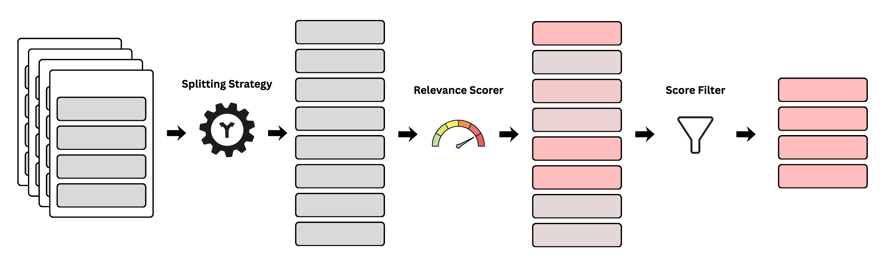

# Preprocessing Text

Learn how to configure text splitting, relevance scoring, and filtering to optimize your extraction pipeline.



## Splitting Strategies

Splitting strategies define how your large documents are broken down into manageable chunks for the LLM.

**Default**: `None` (No splitting - entire record is one chunk).

### 1. Paragraph Split
Splits text at double newlines (`\n\n`).

```python
from delm.strategies import ParagraphSplit
splitting_strategy = ParagraphSplit()
```

### 2. Fixed Window Split
Splits text into chunks of a specific number of sentences, with optional overlap.

```python
from delm.strategies import FixedWindowSplit
splitting_strategy = FixedWindowSplit(window=5, stride=2)
```

### 3. Regex Split
Splits text using a custom regular expression pattern.

```python
from delm.strategies import RegexSplit
splitting_strategy = RegexSplit(pattern=r"\n\n+")
```

## Relevance Scoring

Relevance scorers assign a score (0.0 to 1.0) to each chunk, allowing you to identify and filter out irrelevant text.

**Default**: `None` (No scoring - all chunks get a score of 0.0, or no score column is created).

### 1. Keyword Scorer
Scores chunks based on the presence of specific keywords. Returns 1.0 if any keyword is found, 0.0 otherwise.

```python
from delm.strategies import KeywordScorer
relevance_scorer = KeywordScorer(keywords=["revenue", "profit", "guidance"])
```

### 2. Fuzzy Scorer
Scores chunks using fuzzy string matching. Useful for OCR'd text or slight variations. Returns a score between 0.0 and 1.0 based on the best match.

```python
from delm.strategies import FuzzyScorer
relevance_scorer = FuzzyScorer(keywords=["revenue", "profit", "guidance"])
```
*Note: Requires `pip install rapidfuzz`.*

## Filtering

Once chunks are scored, you can filter them using a pandas-style query string. This ensures you only pay to process relevant chunks.

**Default**: `None` (No filtering).

**Important**: If you provide a `score_filter`, you **must** also provide a `relevance_scorer`. You cannot filter on scores that don't exist.

```python
# Keep chunks with a score of 0.5 or higher
score_filter = "delm_score >= 0.5"

# Keep chunks with a score greater than 0 (at least one keyword match)
score_filter = "delm_score > 0"
```

## Alternative: Dictionary Configuration

Instead of importing classes, you can define any strategy as a dictionary with a `type` field matching the class name. This is useful for saving configurations to YAML or JSON files.

```python
# Equivalent to FixedWindowSplit(window=5, stride=2)
splitting = {
    "type": "FixedWindowSplit",
    "window": 5,
    "stride": 2
}

# Equivalent to KeywordScorer(keywords=["price"])
scoring = {
    "type": "KeywordScorer",
    "keywords": ["price"]
}
```

## Full Example

Pass these configurations directly to the `DELM` constructor.

```python
from delm import DELM
from delm.strategies import FixedWindowSplit, KeywordScorer

# 1. Initialize DELM with strategies
delm = DELM(
    # ... provider/model args ...
    splitting_strategy=FixedWindowSplit(window=10, stride=2),
    relevance_scorer=KeywordScorer(keywords=["price", "cost"]),
    score_filter="delm_score > 0"
)

# 2. Run extraction
delm.prep_data("documents/")
delm.process_via_llm()
```

## Advanced: Custom Strategies

You can implement your own splitting or scoring logic by inheriting from the base classes.

### Custom Splitter

Inherit from `SplitStrategy` and implement the `split` method.

```python
from typing import List
from delm.strategies import SplitStrategy, SPLITTER_REGISTRY

class SentenceSplitter(SplitStrategy):
    def split(self, text: str) -> List[str]:
        # simple example splitting by periods
        return [s.strip() for s in text.split('.') if s.strip()]

    # REQUIRED for checkpointing/disk storage
    def to_dict(self):
        return {"type": "SentenceSplitter"}

    @classmethod
    def from_dict(cls, data: dict):
        return cls()

# Usage
# 1. Register your class (Important for checkpointing!)
SPLITTER_REGISTRY["SentenceSplitter"] = SentenceSplitter

# 2. Pass instance to DELM
delm = DELM(
    # ...
    splitting_strategy=SentenceSplitter()
)
```

### Custom Scorer

Inherit from `RelevanceScorer` and implement the `score` method.

```python
from delm.strategies import RelevanceScorer, SCORER_REGISTRY

class LengthScorer(RelevanceScorer):
    def score(self, text_chunk: str) -> float:
        # Example: Score based on length (longer chunks = higher score)
        return min(len(text_chunk) / 1000, 1.0)

    # REQUIRED for checkpointing/disk storage
    def to_dict(self):
        return {"type": "LengthScorer"}

    @classmethod
    def from_dict(cls, data: dict):
        return cls()

# Usage
# 1. Register your class (Important for checkpointing!)
SCORER_REGISTRY["LengthScorer"] = LengthScorer

# 2. Pass instance to DELM
delm = DELM(
    # ...
    relevance_scorer=LengthScorer(),
    score_filter="delm_score > 0.5"
)
```
